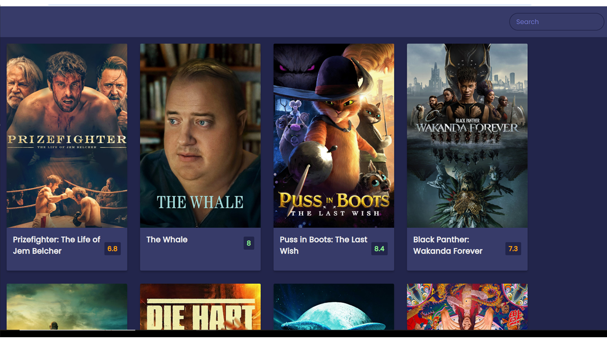

# TheMovieApp
The Movie App is a movie search engine that runs in the browser and features dynamically updated HTML and CSS.  The application uses a third party API from The Movie DB to retrieve movie data and displays title, rating, image and overview of each movie.

Application GitHub URL : <a href= "https://monicadolce.github.io/TheMovieApp/">The Movie App</a> 

## References
---
<a href="https://www.themoviedb.org/documentation/api">The Movie DB<a>